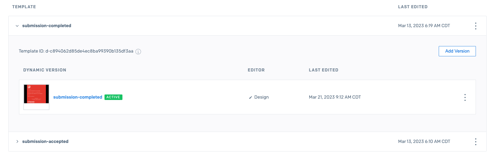
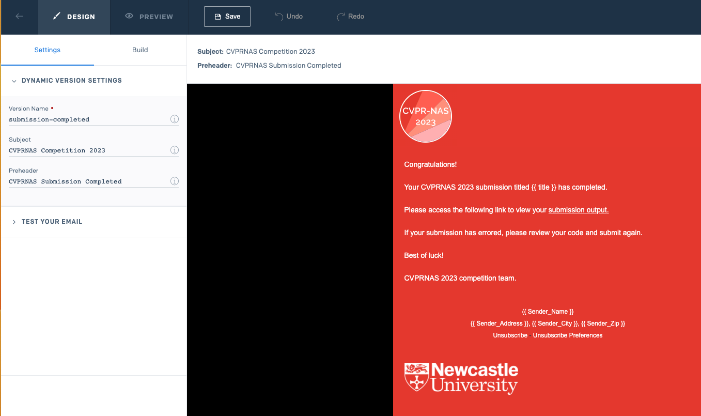
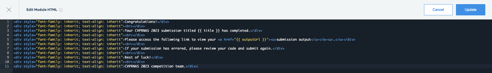

# CVPR-NAS Competition

## About

CVPR-NAS is an annual competition that compares how well Neural Search Architectures can apply machine learning methods to unseen datasets. Competitors must register with a website so that they can download a starting kit and datasets, then use these resources to complete their NAS algorithm.

Their code based entry is then uploaded to the same website which must then allocate resources and run their submitted code. This code run is time limited to one hour. There will only be a limited number of GPUs available to run the code, so jobs may be queued and executed in the order received.

Between 5-10 submissions are expected per day during the allowed submission period. Competitors will ideally have email notification of their code status. It is expected that code will be uploaded in a zip format.


### Project Team
* Stephen McGough - ([stephen.mcgough@newcastle.ac.uk](mailto:stephen.mcgough@newcastle.ac.uk))
* David Towers - ([d.towers2@newcastle.ac.uk](mailto:d.towers2@newcastle.ac.uk))
* Nik Khadijah Nik Aznan  - ([nik.nik-aznan@newcastle.ac.uk](mailto:nik.nik-aznan@newcastle.ac.uk))
* Amir Atapour-Abarghouei - ([amir.atapour-abarghouei@durham.ac.uk](mailto:amir.atapour-abarghouei@durham.ac.uk))


### RSE Contact
Rebecca Osselton
Newcastle University  
([rebecca.osselton@newcastle.ac.uk](rebecca.osselton@newcastle.ac.uk))  

## Built With

[Strapi](https://docs.strapi.io/)  
[Vue](https://vuejs.org/)  


## Getting Started

This website is Vue.js based front-end that connects to a back-end application created using Strapi. [CVPR-NAS-API](https://github.com/NewcastleRSE/CVPR-NAS-API)

The competition has 3 stages. Users are able to upload zip files which are received by the Strapi back-end and recorded. Files are then passed to an Azure batch service with a unique id and run using specific datasets. Once the submissions have been executed via the batch pool, results are returned to the back-end and stored against th rignal submission. The website is able to query the back-end for each submission results and display a ranking of competitors based on runtimes and scores.


### Prerequisites

Vue-cli, Node.js, yarn

### Installation

Clone the repo into a suitable directory. Create an .env file containing value for BASE_URL e.g. BASE_URL=localhost:1338. 

Use Node 16.

Install vue-cli 

`npm install -g @vue/cli`

Install node modules

`npm install`

Install yarn

`npm i yarn`

### Running Locally

`yarn serve` to start the webserver.

## Deployment

`yarn build` to build the application ready for deployment. Source code is minified and compiled in a 'dist' directory. Contents of the dist folder can then form the basis of a static front-end. The application is currently manually deployed to Azure (RSE Team General -> Storage Accounts -> cvprnas -> Blob Containers -> $web) using Azure Storage Explorer. Files and folders are deleted and then re-uploaded from the lastest compiled contents of the dist folder.

Part of the the pipeline process is that emails are sent to all users that submit code via the website. An initial 'submission-accepted' notification on submission and then a 'submission-completed' email after the batch process has completed. The submission-completed email contains a link to the output file generated on Azure  (RSE Team General -> Storage Accounts -> cvprnas -> Blob Containers -> outputs) . The email link is in the format of <path-to-file?sasToken>.

The email service is provided by SendGrid which is set up as SaaS on Azure. This account may expire due to inactivity so may need to be recreated as each year. To access SendGrid you need to login through the Azure portal link `Open SaaS Account on publisher's site`. The current service is free up to 100 emails a day.

Once in the SendGrid site there is access to the email templates in the Email API section. Email API -> Dynamic templates. Expand each email section to see the template ID and a preview thumbnail of the email. The correct template ids and account API key must be set as environment variable values in the Azure hosted strapi backend - cvprnas App Service -> Configuration. Th API key is at Settings -> API keys, the value is hidden but has the format: `SG.<api-key-id>.xxx`

```
SENDGRID_API_KEY
SENDGRID_COMPLETED_TEMPLATE
SENDGRID_SUBMISSION_TEMPLATE
```



The email templates can be edited by using the SendGrid design Settings and Build features.



You can edit the source code for sections by clcking the < > Edit Module HTML button.



There is also a function to preview the emai design and set dummy data. Click the PREVIEW button on the main navigation bar, then the 'Show test data' button. Test emails can be sent to address of your choosing, using the dummy data.

## Branches

Main and dev only
